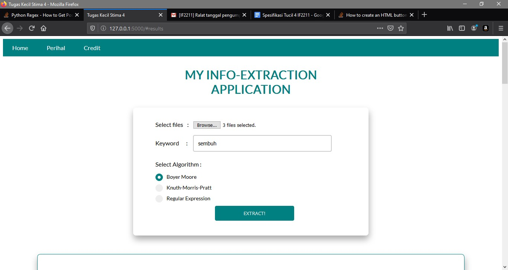
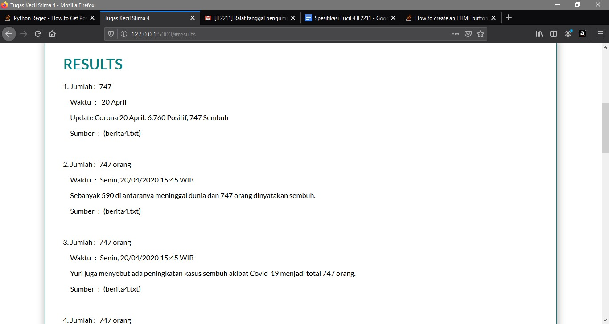

# TUGAS KECIL 4 IF2211-STRATEGI ALGORITMA
```
Tugas kecil 4 untuk memenuhi tugas mata kuliah IF2211-Strategi ALGORITMA:
Ekstraksi Informasi dari Artikel Berita dengan Algoritma Pencocokan String
```

## Getting Started
### Prerequisites
python 3
```
Windows : download python dari https://www.python.org/downloads/windows/ dan lakukan isntalasi
Linux : sudo apt-get install python3
```

Flask 1.1.2
```
Windows: pip install -U flask
Linux : sudo apt install python3-flask
```

nltk, version 3.5
```
Windows: pip install -U ntlk
Linux : sudo apt install python3-nltk
```

### Instalasi

1. Buka cmd atau terminal di directory folder scr
2. Jalankan perintah berikut di cmd atau terminal
```
Windows : py web.py
Linux : python3 web.py
```
3. Akan muncul tulisan berikut di cmd atau terminal
```
 * Serving Flask app "web" (lazy loading)
 * Environment: production
   WARNING: This is a development server. Do not use it in a production deployment.
   Use a production WSGI server instead.
 * Debug mode: on
 * Restarting with stat
 * Debugger is active!
 * Debugger PIN: 301-019-789
 * Running on http://127.0.0.1:5000/ (Press CTRL+C to quit)
 ```
4. Copy alamat url http://127.0.0.1:5000/ yang muncul 
5. Buka browser (disarankan mozila firefox atau chrome)
6. Paste url

## Menjalankan Data Uji

1. Klik button browse pada pada label select files
2. Masukkan text berita dari folder test (hanya berita dari folder test saja yang dapat diterima)
3. Ketikkan keyword
4. Pilih algoritma
5. Tekan button EXTRACT
6. Hasil akan ditampilkan

## Sample Screen



## Built With

* [Python](https://docs.python.org/3/)
* [Flask](https://pypi.org/project/Flask/)


